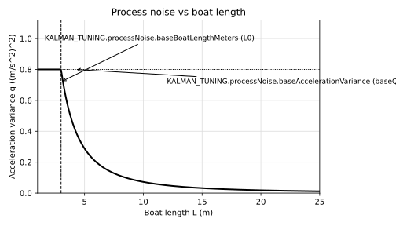
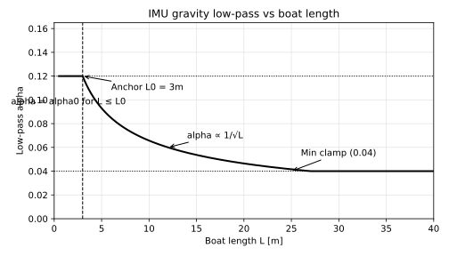

# Tuning reference

Note: LaTeX version maintained in `docs/tuning.tex` and compiled via `docs/master.tex`.

This file documents the gain scheduling rules in `tuning.js`. All variable names
refer to `KALMAN_TUNING` so the plots stay tied to the actual configuration.
Plots are generated by `scripts/plot_tuning.py`.

## Process noise vs boat length (acceleration variance)

We scale the base acceleration variance by boat length so longer boats respond
more slowly. For lengths shorter than the anchor, we do not increase the base
value.

$$
q = \text{baseQ} \left(\frac{L_0}{\max(L_0, L)}\right)^2
$$

Variables:
- `KALMAN_TUNING.processNoise.baseAccelerationVariance` = $\text{baseQ}$
- `KALMAN_TUNING.processNoise.baseBoatLengthMeters` = $L_0$

## Speed scale from recent max speed

The process noise is further scaled by recent max speed (not instantaneous speed).
We use the maximum speed over a recent window to capture the boat's potential to
accelerate even if it is currently slow.

$$
\text{speedScale} = \frac{\max(v^*_{\text{kn}}, v_{\min})}{v_{\text{anchor}}}
$$

Variables:
- `KALMAN_TUNING.processNoise.speedScale.minKnots` = $v_{\min}$
- `KALMAN_TUNING.processNoise.speedScale.anchorKnots` = $v_{\text{anchor}}$
- `KALMAN_TUNING.processNoise.speedScale.recentMaxSpeedWindowSeconds` defines
  the window used to compute $v^*$

## IMU gravity low-pass vs boat length

The gravity estimate is low-pass filtered so the down axis stays stable in waves.
We scale the low-pass factor by boat length: larger boats get a slower response.

$$
\alpha = \text{clamp}\left(\alpha_0 \sqrt{\frac{L_0}{\max(L_0, L)}},\; \alpha_{\min},\; \alpha_{\max}\right)
$$

Variables:
- `KALMAN_TUNING.imu.gravityLowPass.baseAlpha` = $\alpha_0$
- `KALMAN_TUNING.imu.gravityLowPass.baseBoatLengthMeters` = $L_0$
- `KALMAN_TUNING.imu.gravityLowPass.minAlpha` = $\alpha_{\min}$
- `KALMAN_TUNING.imu.gravityLowPass.maxAlpha` = $\alpha_{\max}$

## Process noise anisotropy (forward vs lateral)

Boats change speed much more easily along their heading than sideways. We encode that
by scaling the lateral acceleration variance as a fixed fraction of the forward variance:

$$
q_{\\text{lateral}} = \\rho\\,q_{\\text{forward}}
$$

Variables:
- `KALMAN_TUNING.imu.lateralVarianceRatio` = $\\rho$
